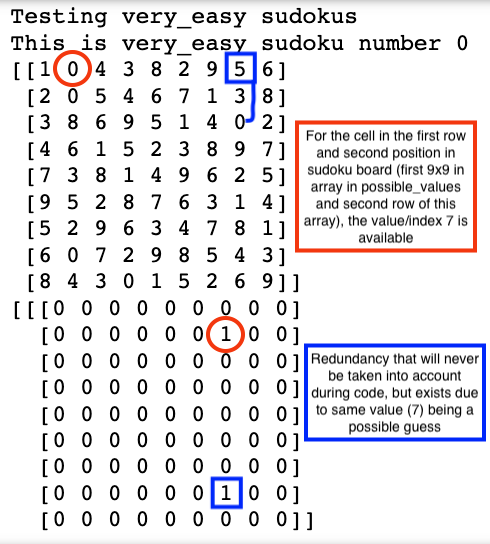
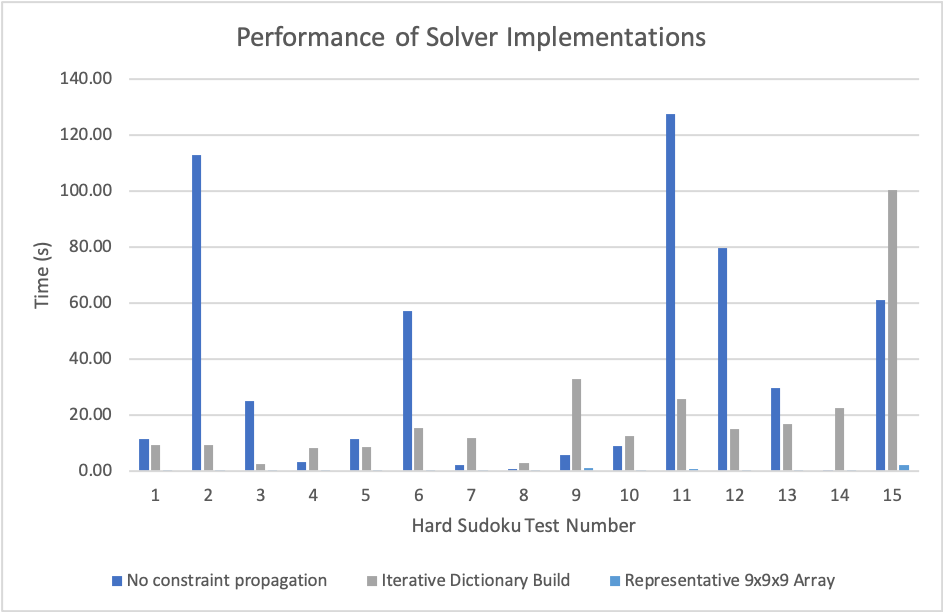

<h1>Sudoku Solver</h1>
 

<h2><u>Project Overview</u></h2>
This project contains a sudoku solver, written in Python, which solves for 9x9 sudoku puzzles. The puzzles can contain invalid start states, or those without a solution.
This implementation of a sudoku solver uses a back-tracking depth first search algorithm, with constraint propagation. In the event of an 
insolvable sudoku board, a 9x9 numpy array of -1s is returned.   

 
 
 
<h2><u>Code Design</u></h2>
 

| Function     | Parameters  | Description|Returns|
| -----------  | ----------- |----------- |---------- |
| sudoku_solver| sudoku [9x9 numpy array]| Checks validity of board passed in as argument, initialises a 9x9x9 array of possible values, where each position in the 9x9 sudoku board has a representation of valid possible values, a row in one of the nine, 9x9 arrays - this also requires removing values that cannot exist by sudoku's logic.   Recursively calls *solver* until board solved or computed insolvable.              | solved sudoku / unsolved sudoku [9x9 numpy array]|
|solver| sudoku, possible_values|Carries out a back-tracking depth-first search algorithm with constraint propagation. The position to evaluate is always the position with the least number of possible values. Guesses are made for that position and subsequent updates to the set of possible values.| True / False [Boolean] |
| remove|possible_values, row, col, value| Loops over rows, columns and boxes in the board to identify and remove invalid values from the *possible_values* array.| cells_changed [List]|
| get_cell_least_val|sudoku, possible_values| Loops board to find the empty position with the least number of valid possible values.| (row,col)[Tuple] / False [Boolean]|
| reset|possible_values, value, changed_cells| Loops over *possible_values* and resets each representative possible value back to 1.| [None]|
| initial_invalid |sudoku | Loops over board, checking each position and cross referencing row, col and box to identify duplicate values, nullifying the validity of the board argument if sudoku's game logic is defied.| True [Boolean]|

 

* No final validity check required, but if so, the fastest method would be one which checks the sum of columns, rows and boxes to each be equal to 405.

 
<h2>Example of code fundementals</h2>

 

 

 
 
 
<h2><u>Algorithm Performance</u></h2>

A good example of an initial benchmark for this problem is the following implementation

[Tech With Tim's implementation](https://www.techwithtim.net/tutorials/python-programming/sudoku-solver-backtracking/)

The above solution does not implement any constraint propagation in any way and instead solves for each position based on the 
first occurance of an empty value. An improvement on this can be made by solving for the position which has the least number of possible values available. More on why this is the best strategy with performance statistics (on a high-level, less recursive calls are required): 

[Solving for a single position with the least number of possible values ](https://stackoverflow.com/questions/1518346/optimizing-the-backtracking-algorithm-solving-sudoku/48239141#48239141)

The following performance test has been carried out on the test set of **hard** sudoku boards provided in the jupyter notebook file,
 comparing the above benchmark without constraint propagation (Tech With Tim's solution), a solution which solves by creating a dictionary based on positions with
 the least number of possible values in the board - called each time an empty position has a valid possible value 'guessed' in, and a third solution which evaluates the position with the least number of possible values, constraining using a 9x9x9 array as demonstrated above.
  
  

 

 

| Implementation     | Total (s) | Average Time per sudoku (s)|
| -----------  | ----------- |----------- |
| No constraint prop  | 535.47 |35.83 |
| Dictionary  | 294.38 | 19.63 |
| 9x9x9 array  | 8.50  | 0.57 |

 

Generally searching for the lowest possible value decreases time complexity compared to the benchmark, however in some cases the actual process of 
 searching and building the dictionary for the lowest possible value position increases complexity (tests: 4, 7, 8, 9, 14 and 15). By checking the lowest possible values in all
 positions, preemptively removing invalid values, and using a constant array, less recursive calls of *solver* are required, and so time complexity is reduced significantly. 

 
<h3><u>System</u></h3>
 Time (in seconds) is averaged across 3 runs, on a Macbook Pro 2017 - 16 GB RAM, 2.5 GHz Dual-Core Intel Core i7, restarting the ipynb file upon each execution, and with no applications running in the background.
 
 
